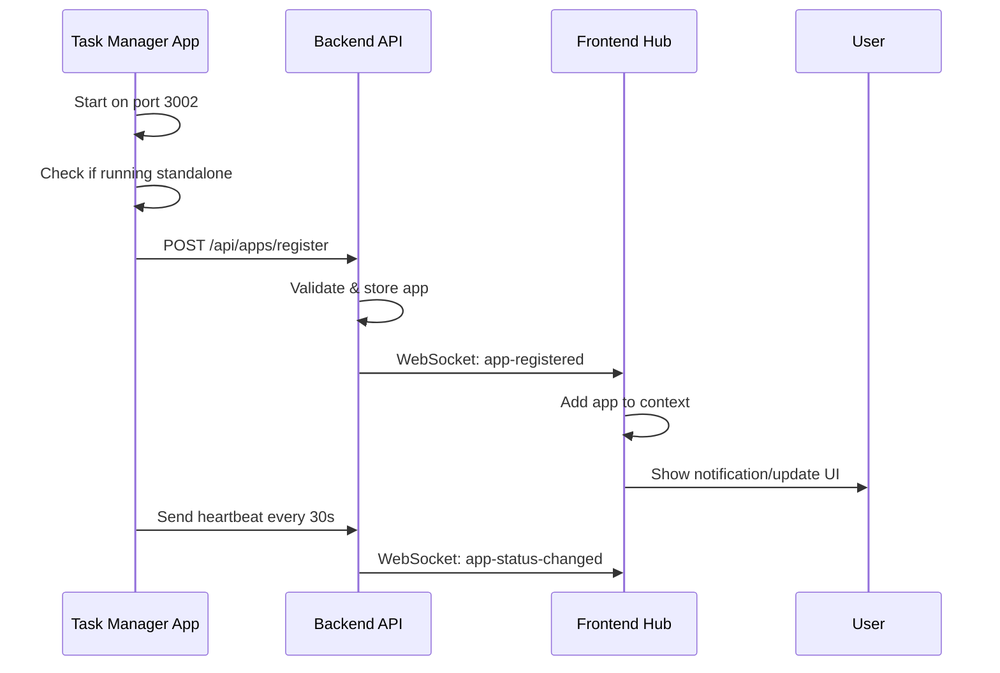
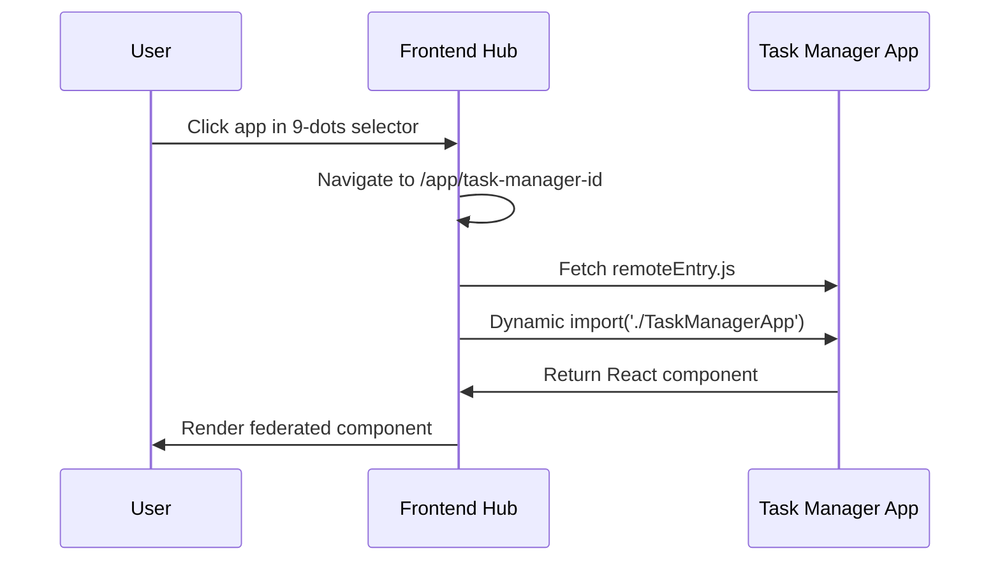

# FrontFuse Module Federation Implementation Summary

## 🎯 What We've Accomplished

We have successfully implemented a **complete runtime module federation system** where Docker containers with frontend apps can:

1. **Self-register at runtime** via REST API
2. **Be dynamically loaded** into the hub portal
3. **Communicate via frontend SDK** package
4. **Share dependencies efficiently** (React/React-DOM as singletons)
5. **Monitor health status** with heartbeat system

## 🔧 Implementation Details

### 1. **Task Manager App with Module Federation**

**Files Modified/Created:**

- `task-manager-app/vite.config.ts` - Module Federation configuration
- `task-manager-app/src/registration.ts` - Self-registration logic
- `task-manager-app/src/main.tsx` - Auto-registration on startup
- `task-manager-app/package.json` - Added federation dependencies
- `task-manager-app/Dockerfile` - Multi-stage build with nginx
- `task-manager-app/nginx.conf` - CORS + Module Federation support
- `task-manager-app/public/task-icon.svg` - Custom app icon

**Key Features:**

- Exposes `./TaskManagerApp` component via Module Federation
- Automatically registers with hub when running on port 3002
- Sends heartbeat every 30 seconds to maintain health status
- Shares React/React-DOM dependencies as singletons
- Production-ready Docker configuration

### 2. **Backend API Enhancement**

**Files Modified:**

- `backend/src/routes/apps.ts` - Added `/api/apps/register` endpoint
- `backend/Dockerfile` - New Docker configuration

**Key Features:**

- **POST /api/apps/register** - No authentication required for self-registration
- Validates Module Federation requirements (remoteUrl, scope, module)
- Emits WebSocket `app-registered` events for real-time notifications
- Returns existing app if duplicate registration (prevents errors)
- Comprehensive health checking system

### 3. **Frontend Hub Updates**

**Files Modified:**

- `frontend/src/App.tsx` - Added WebSocket listener for app registrations
- `frontend/Dockerfile` - New Docker configuration
- `frontend/nginx.conf` - Module Federation CORS support

**Key Features:**

- Real-time updates when apps register via WebSocket
- Dynamic app loading using existing FederatedAppLoader
- Zero build-time knowledge of available apps
- Error boundaries and fallback handling

### 4. **Shared Context Enhancement**

**Files Modified:**

- `shared/src/context/AppContext.tsx` - Added ADD_APP action

**Key Features:**

- `ADD_APP` action type for dynamic app addition
- Prevents duplicate app entries
- Real-time state updates for app health status

### 5. **SDK Integration**

**SDK Features Used:**

- `createHeartbeat()` - For health monitoring
- Module federation utilities (already existed)
- Context integration hooks

### 6. **Monorepo Integration**

**Files Modified:**

- `package.json` - Added task-manager-app to workspaces
- Added comprehensive npm scripts for development and demo

**New Scripts:**

- `npm run dev:all` - Start all services
- `npm run demo` - Interactive demo script
- `npm run docker:build` - Build all Docker images
- `npm run docker:up` - Start with Docker Compose

### 7. **Docker Orchestration**

**Files Created:**

- `docker-compose.yml` - Complete system deployment
- Individual Dockerfiles for all services
- nginx configurations with proper CORS

### 8. **Documentation**

**Files Created/Updated:**

- `MODULE_FEDERATION_GUIDE.md` - Comprehensive implementation guide
- `README.md` - Updated with Module Federation features
- `scripts/demo.js` - Interactive demo script
- `IMPLEMENTATION_SUMMARY.md` - This summary

## 🚀 How It Works

### Registration Flow



### Loading Flow



## 🎯 Demo Experience

When you run `npm run demo`, you'll see:

1. **Automatic Registration**: Task Manager registers itself with the hub
2. **Real-time Notification**: Hub shows "New app registered" message
3. **Dynamic Loading**: App appears in 9-dots selector immediately
4. **Module Federation**: Click to load app with shared React dependencies
5. **Health Monitoring**: Real-time status updates via heartbeat

## 🔑 Key Technical Achievements

### ✅ **Zero Build-time Dependencies**

- Hub has no knowledge of apps at compile time
- Apps are discovered and loaded dynamically at runtime
- No need to rebuild hub when adding new apps

### ✅ **True Module Federation**

- Shared React/React-DOM dependencies (singleton pattern)
- Type-safe component loading
- Optimal performance with shared chunks

### ✅ **Self-Registration System**

- Apps register themselves via REST API
- No manual configuration required
- Automatic health monitoring

### ✅ **Real-time Updates**

- WebSocket notifications for app events
- Live status monitoring
- Dynamic UI updates

### ✅ **Production Ready**

- Multi-stage Docker builds
- Proper nginx configurations
- Health checks and monitoring
- Docker Compose orchestration

### ✅ **Developer Experience**

- Comprehensive documentation
- Interactive demo script
- Simple setup commands
- Clear error handling

## 🛠️ Usage

### Development Mode

```bash
npm run install:all
npm run db:init
npm run demo
```

### Docker Mode

```bash
npm run docker:build
npm run docker:up
```

### Creating New Apps

```bash
# Follow MODULE_FEDERATION_GUIDE.md
npm create vite@latest my-app -- --template react-ts
# Configure Module Federation
# Add self-registration
# Start and watch it auto-register!
```

## 📊 Architecture Benefits

1. **Scalability**: Add new apps without touching existing code
2. **Independence**: Apps can be developed and deployed separately
3. **Performance**: Shared dependencies reduce bundle size
4. **Flexibility**: Support for different integration types
5. **Monitoring**: Real-time health status and notifications
6. **DevOps**: Containerized deployment with Docker

## 🎉 Conclusion

We have successfully created a **production-ready module federation platform** that demonstrates:

- **Runtime app discovery** and dynamic loading
- **Zero build-time coupling** between hub and apps
- **Self-registration capabilities** for containerized apps
- **Real-time monitoring** and status updates
- **Comprehensive documentation** and examples

The system is ready for:

- **Development use** with the demo
- **Production deployment** with Docker
- **Extension** with new micro-frontends
- **Integration** with existing applications

This implementation serves as a complete reference for building scalable microfrontend platforms with modern tools and best practices.
