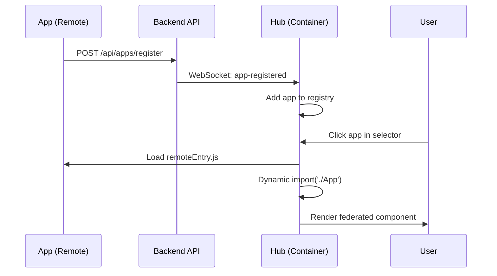

# FuzeFront Platform

A modern microfrontend platform built with Node.js, TypeScript, React, and Vite, featuring **runtime Module Federation** for dynamic app discovery and loading with zero build-time dependencies.

## 🚀 Features

- **🔗 Runtime Module Federation**: Apps can self-register and be loaded dynamically without rebuild
- **📦 Zero Build-time Knowledge**: Hub has no knowledge of apps at compile time
- **🔄 Dynamic App Discovery**: Apps register themselves via REST API at runtime
- **Multi-Integration Support**: Module Federation, Iframe, and Web Components
- **Real-time App Status**: WebSocket-based heartbeat system for live app monitoring
- **Authentication & Authorization**: JWT-based auth with role management
- **Modern UI**: Dark/light themes, responsive design, internationalization (English/Hebrew)
- **9-Dots App Selector**: Google/Atlassian-style app launcher with health indicators
- **Avatar User Menu**: Modern user management interface
- **Health Monitoring**: Real-time app health checks with visual indicators
- **WebSocket Communication**: Real-time updates and notifications
- **Smart Navigation**: Context-aware routing and deep linking
- **🐳 Docker Support**: Containerized deployment for micro-frontends
- **Graceful Shutdown**: Proper cleanup and port conflict handling
- **Interactive API Documentation**: Swagger/OpenAPI documentation
- **Comprehensive Help System**: Built-in guides and documentation

## 📦 Architecture

This is a monorepo managed with **Lerna** containing:

- **`backend/`** - Node.js/Express API server with SQLite database
- **`frontend/`** - React/Vite main platform interface (Module Federation Container)
- **`shared/`** - Shared types, contexts, and utilities
- **`sdk/`** - React SDK for microfrontend integration and self-registration
- **`task-manager-app/`** - Example microfrontend with Module Federation

## 🎯 Quick Demo

### Option 1: Development Mode

```bash
# Install all dependencies
npm run install:all

# Initialize database
npm run db:init
npm run db:seed

# Start all services including the task manager demo
npm run demo
```

This starts:

- **Hub Portal** on `http://localhost:5173` (Module Federation Container)
- **Backend API** on `http://localhost:3001` (App Registry & WebSocket)
- **Task Manager** on `http://localhost:3002` (Example Micro-frontend)

### Option 2: Docker Mode

```bash
# Build and run all services with Docker
npm run docker:build
npm run docker:up
```

Access the platform at `http://localhost:3000`

### What You'll See

1. **Task Manager app automatically registers** itself with the hub when started
2. **Real-time notification** appears in the hub when the app registers
3. **App appears in the 9-dots selector** ready to be loaded
4. **Click to load the app** using Module Federation (shared React instances)
5. **Heartbeat system** keeps the app status updated in real-time

## 🔗 Module Federation Implementation

### 1. **Hub Portal (Container)**

The frontend acts as a Module Federation container that:

- Has no knowledge of apps at build time
- Dynamically loads apps at runtime based on registry data
- Shares React/React-DOM as singletons
- Provides error boundaries and fallbacks

### 2. **Apps (Remotes)**

Each app (like task-manager-app) can:

- **Self-register** with the hub via REST API
- **Expose components** via Module Federation
- **Send heartbeats** to maintain health status
- **Share dependencies** for optimal performance

### 3. **Dynamic Discovery Flow**



## 🛠️ Tech Stack

- **Backend**: Node.js, Express, TypeScript, SQLite, Socket.IO
- **Frontend**: React, TypeScript, Vite, Module Federation
- **Monorepo**: Lerna, npm workspaces
- **Code Quality**: ESLint, Prettier, Husky, lint-staged, commitlint
- **Integration**: Module Federation, Iframe, Web Components
- **Containerization**: Docker, Docker Compose, Multi-stage builds

## 🏃‍♂️ Development

### Available Scripts

```bash
# Development
npm run dev                 # Start backend + frontend
npm run dev:all             # Start all services including task-manager
npm run dev:backend         # Start backend only
npm run dev:frontend        # Start frontend only
npm run dev:task-manager    # Start task manager example

# Building
npm run build               # Build all packages
npm run build:all           # Build all including task-manager
npm run type-check          # Type check all packages
npm run lint                # Lint all packages

# Database
npm run db:init             # Initialize database
npm run db:seed             # Seed with demo data

# Docker
npm run docker:build        # Build all Docker images
npm run docker:up           # Start all services with Docker
npm run docker:down         # Stop all Docker services
```

### Creating New Micro-frontends

See the comprehensive guide: [MODULE_FEDERATION_GUIDE.md](./MODULE_FEDERATION_GUIDE.md)

Quick setup:

```bash
# 1. Create new Vite React app
npm create vite@latest my-app -- --template react-ts

# 2. Add Module Federation
npm install @originjs/vite-plugin-federation --save-dev
npm install @fuzefront/sdk-react

# 3. Configure vite.config.ts with federation setup
# 4. Add self-registration code
# 5. Start and watch it auto-register with the hub!
```

## 💓 Heartbeat & Self-Registration

Apps using the FuzeFront SDK can self-register and maintain health status:

```typescript
import { createHeartbeat } from '@fuzefront/sdk-react'

// Auto-register when running standalone
async function autoRegister() {
  const response = await fetch('http://localhost:3001/api/apps/register', {
    method: 'POST',
    headers: { 'Content-Type': 'application/json' },
    body: JSON.stringify({
      name: 'My App',
      url: 'http://localhost:3003',
      integrationType: 'module-federation',
      remoteUrl: 'http://localhost:3003',
      scope: 'myApp',
      module: './App',
    }),
  })

  if (response.ok) {
    const app = await response.json()

    // Start heartbeat
    const heartbeat = createHeartbeat({
      appId: app.id,
      backendUrl: 'http://localhost:3001',
      interval: 30000,
    })
    heartbeat.start()
  }
}
```

## 🔌 Integration Types

### 1. Module Federation (Recommended)

**Best Performance** - Shared dependencies, type safety, rich integration

```typescript
{
  integrationType: 'module-federation',
  remoteUrl: 'https://myapp.example.com',
  scope: 'myApp',
  module: './App'
}
```

### 2. Iframe

**Maximum Isolation** - Any technology, complete sandboxing

```typescript
{
  integrationType: 'iframe',
  url: 'https://myapp.example.com'
}
```

### 3. Web Component

**Standards Based** - Framework agnostic, good encapsulation

```typescript
{
  integrationType: 'web-component',
  remoteUrl: 'https://myapp.example.com/component.js',
  scope: 'my-web-component'
}
```

## 🎯 Default App Icons

The platform automatically assigns icons based on integration type:

- **Module Federation**: 🔗 (Link icon - best performance)
- **Iframe**: 🖼️ (Frame icon - maximum isolation)
- **Web Component**: ⚡ (Lightning icon - standards based)

## 🎨 Theming

The platform supports dark/light themes using CSS custom properties:

```css
:root {
  --bg-primary: #ffffff;
  --bg-secondary: #f8f9fa;
  --text-primary: #212529;
  --accent-color: #007bff;
}

[data-theme='dark'] {
  --bg-primary: #1a1a1a;
  --bg-secondary: #2d2d2d;
  --text-primary: #ffffff;
  --accent-color: #4dabf7;
}
```

## 🌐 Internationalization

Supports English and Hebrew with RTL layout:

```typescript
import { useLanguage } from './contexts/LanguageContext';

function MyComponent() {
  const { t, language, setLanguage } = useLanguage();

  return (
    <div>
      <h1>{t('welcome')}</h1>
      <button onClick={() => setLanguage('he')}>עברית</button>
    </div>
  );
}
```

## 📝 Commit Convention

This project uses [Conventional Commits](https://conventionalcommits.org/):

```bash
feat(frontend): Add new app selector component
fix(backend): Resolve authentication token validation
docs(readme): Update installation instructions
chore(deps): Update dependencies
```

### Allowed Types

- `feat` - New feature
- `fix` - Bug fix
- `docs` - Documentation
- `style` - Formatting changes
- `refactor` - Code refactoring
- `perf` - Performance improvements
- `test` - Adding tests
- `chore` - Maintenance tasks
- `ci` - CI/CD changes
- `build` - Build system changes

### Allowed Scopes

- `backend`, `frontend`, `shared`, `sdk`, `task-manager`
- `auth`, `ui`, `api`, `websocket`, `heartbeat`
- `theme`, `i18n`, `build`, `deps`

## 🔒 Security

- JWT-based authentication
- Role-based access control (RBAC)
- CORS configuration for Module Federation
- Helmet.js security headers
- Input validation and sanitization

## 🚀 Deployment

### Production Build

```bash
npm run build:all
```

### Environment Variables

```bash
# Backend
PORT=3001
NODE_ENV=production
JWT_SECRET=your-secret-key
DB_PATH=/path/to/database.sqlite
FRONTEND_URL=https://your-domain.com

# Frontend
VITE_API_URL=https://api.your-domain.com
```

### Docker Deployment

```bash
# Production deployment with Docker Compose
docker-compose -f docker-compose.yml up -d
```

## 📊 Database Schema

The platform uses SQLite with the following main tables:

- **users** - User accounts and authentication
- **apps** - Registered microfrontend applications with federation metadata
- **sessions** - User sessions (if using session-based auth)

## 🤝 Contributing

We welcome contributions from the community! FuzeFront is built by developers, for developers, and we appreciate all forms of contribution.

### Quick Start for Contributors

1. **Read our policies**:

   - 📋 [Contributing Guide](CONTRIBUTING.md) - Comprehensive contribution guidelines
   - 🤝 [Code of Conduct](CODE_OF_CONDUCT.md) - Community standards and expectations
   - 🔒 [Security Policy](SECURITY.md) - Security vulnerability reporting

2. **Set up your development environment**:

   ```bash
       git clone https://github.com/your-username/FuzeFront.git
    cd FuzeFront
    npm install
   npm run dev
   ```

3. **Make your contribution**:
   - 🐛 **Bug fixes**: Use our [bug report template](.github/ISSUE_TEMPLATE/bug_report.md)
   - ✨ **New features**: Use our [feature request template](.github/ISSUE_TEMPLATE/feature_request.md)
   - 📝 **Documentation**: Help improve our docs and guides
   - 🧪 **Testing**: Add or improve test coverage
   - 🔧 **Code quality**: Refactoring and performance improvements

### Development Workflow

We use a structured development workflow with automated quality checks:

```bash
# 1. Create feature branch
git checkout -b feat/your-feature-name

# 2. Make changes and test locally
npm run type-check
npm run lint
npm run test
npm run build

# 3. Commit with conventional format
git commit -m "feat(component): add new feature"

# 4. Push and create PR
git push origin feat/your-feature-name
```

### Automated Quality Assurance

Every contribution goes through our comprehensive CI/CD pipeline:

- ✅ **Linting & Type Checking**: Code quality validation
- 🏗️ **Build Verification**: Ensures all components build successfully
- 🧪 **Automated Testing**: Unit and integration tests
- 🔒 **Security Scanning**: Vulnerability and dependency auditing
- 📝 **Commit Message Validation**: Conventional commit compliance

### Areas for Contribution

- **🏗️ Core Platform**: Container shell and module federation improvements
- **🔧 Backend API**: Authentication, app management, and API enhancements
- **📦 SDK Development**: Developer experience tools and utilities
- **📚 Documentation**: Guides, examples, and API documentation
- **🧪 Testing**: Test coverage and quality assurance
- **⚡ Performance**: Optimization and monitoring improvements
- **🎨 UI/UX**: Design and accessibility enhancements

### Recognition

Contributors are recognized through:

- 📝 README contributors section (coming soon)
- 🎉 Release notes for significant contributions
- 📊 GitHub contributor statistics
- 🏆 Special mention for security disclosures

### Community Support

- 💬 **GitHub Discussions**: Ask questions and share ideas
- 🐛 **GitHub Issues**: Report bugs and request features
- 📖 **Documentation**: Comprehensive guides and examples
- 👥 **Code Reviews**: Learn from experienced contributors

---

## 📄 License

This project is licensed under the MIT License - see the [LICENSE](LICENSE) file for details.

## 🆘 Support

- 📧 Email: support@frontfuse.dev
- 📖 Documentation: [docs.frontfuse.dev](https://docs.frontfuse.dev)
- 🐛 Issues: [GitHub Issues](https://github.com/your-org/frontfuse-platform/issues)

## 🗺️ Roadmap

- [x] **Runtime Module Federation** - Zero build-time dependencies ✅
- [x] **Self-registering Apps** - Dynamic discovery via REST API ✅
- [x] **Docker Support** - Containerized micro-frontends ✅
- [x] **Heartbeat System** - Real-time health monitoring ✅
- [ ] Plugin system for custom integrations
- [ ] Advanced analytics and monitoring
- [ ] Multi-tenant support
- [ ] Kubernetes deployment manifests
- [ ] Advanced caching strategies
- [ ] Performance monitoring dashboard
- [ ] CI/CD pipeline templates for new apps

## 🛠️ Development Setup

### Prerequisites

- Node.js 18+
- npm or yarn
- Git

### Quick Start

1. **Clone and install**:

   ```bash
   git clone <repository-url>
   cd frontfuse
   npm install
   ```

2. **Start development servers**:

   ```bash
   npm run dev
   ```

   This starts both frontend (port 5173) and backend (port 3001)

3. **Access the platform**:
   - **Main Platform**: http://localhost:5173
   - **API Documentation**: http://localhost:3001/api-docs
   - **Health Check**: http://localhost:3001/health

### Port Conflict Resolution

The backend now handles port conflicts gracefully:

- **Automatic Port Detection**: Finds available ports starting from 3001
- **Graceful Shutdown**: Clean shutdown with Ctrl+C
- **Error Recovery**: Proper error handling and logging

If you encounter port conflicts, the backend will:

1. Detect the conflict
2. Try the next available port (3002, 3003, etc.)
3. Update all references automatically
4. Display the new port in console output

### Manual Cleanup (if needed)

If you need to manually clean up port conflicts:

**Windows**:

```bash
# From backend directory
npm run cleanup

# Or manually
netstat -ano | findstr :3001
taskkill /F /PID <process-id>
```

**Mac/Linux**:

```bash
# Find process using port
lsof -ti:3001

# Kill process
kill -9 $(lsof -ti:3001)
```

## 📱 Running Individual Components

### Backend Only

```bash
cd backend
npm run dev
```

### Frontend Only

```bash
cd frontend
npm run dev
```

### Task Manager Example App

```bash
cd task-manager-app
npm run dev
```

## 🧪 Default Users

The platform comes with pre-configured users:

- **Admin User**:

  - Email: `admin@frontfuse.dev`
  - Password: `admin123`
  - Roles: `admin`, `user`

- **Regular User**:
  - Email: `user@frontfuse.dev`
  - Password: `user123`
  - Roles: `user`

## 📚 Documentation

- **Help System**: Available in the platform at `/help`
- **API Documentation**: http://localhost:3001/api-docs
- **Developer Guide**: `/docs/developer-guide.md`

## 🏗️ Creating Microfrontend Apps

See the [Developer Guide](docs/developer-guide.md) for complete instructions on:

- Setting up Module Federation
- Using the FrontFuse SDK
- Implementing authentication
- Adding menu items
- Deployment strategies

## 🔧 Troubleshooting

### Common Issues

**Port Already in Use**:

- The backend now handles this automatically
- Use `npm run cleanup` if manual intervention needed

**Module Federation Errors**:

- Check that remoteUrl is accessible
- Verify scope and module names match configuration

**Authentication Issues**:

- Clear browser localStorage
- Check JWT token expiration
- Verify user credentials

### Debug Mode

Enable debug logging:

```bash
DEBUG=frontfuse:* npm run dev
```

### Health Checks

Monitor application health:

```bash
curl http://localhost:3001/health
```
