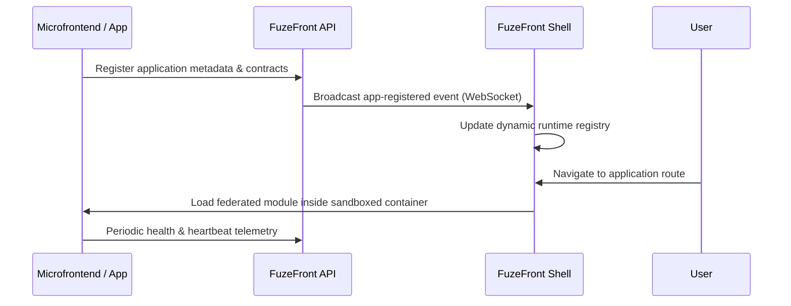

# FuzeFront

[](LICENSE)
[](https://github.com/izzywdev/FuzeFront/issues?q=is%3Aissue%20state%3Aopen%20label%3A%22good%20first%20issue%22)
[](https://github.com/izzywdev/FuzeFront/issues?q=is%3Aissue%20state%3Aopen%20label%3A%22help%20wanted%22)
[](ROADMAP.md)
[](COMMUNITY.md)

**The Vibe Coding Platform for Enterprise Software with Kubernetes — A Software Factory for Software Factories.**

FuzeFront is the runtime hosting platform and governance control plane of the Fuze ecosystem. It provides the core architectural foundation to compose, sandbox, and automatically deploy distributed microservices and microfrontends directly to Kubernetes across any cloud of choice.

Instead of treating AI and modern development velocity as chaotic, unmanaged "vibe coding," FuzeFront transforms it into a **governed Software Factory**. It allows independently built applications to dynamically self-register at runtime, live inside a unified product shell, inherit strict architectural guardrails, and scale seamlessly without forcing every product into a fragile monolith or causing architectural drift.

---

## Three Operating Models: One Governed Platform

Whether you are an enterprise securing internal software development, a software house delivering client solutions, or a solo founder building a multi-product portfolio, FuzeFront provides the exact structural leverage you need:

| Operating Model | The Core Challenge | How FuzeFront Solves It | The Transformation |
|---|---|---|---|
| **🏢 Enterprises**<br>*In-House App Portal & Software Factory* | Teams want the velocity of modern "semi-Vibe coding," but enterprises cannot tolerate architectural drift, security gaps, and deployment bottlenecks. | Serves as the **internal microfrontend hosting platform**: rigid runtime entrance gates, tokenized design systems, declarative UI/API isolation, ReBAC/ABAC middleware, and sandboxed runtimes. | Business units safely build and deploy internal tools within a unified hosting platform without risking architectural collapse. |
| **🏭 Software Houses**<br>*Agentic Production Factory* | High overhead from repetitive project scaffolding, fragmented client architectures, manual QA, and brittle handoffs. | Serves as the **end-to-end client delivery engine**: standardizes the agentic software development lifecycle (FuzeSDLC + FuzeAgent) from requirements to automated deployment. | Rapid, repeatable delivery of custom, governed enterprise applications with compounding reuse across client projects. |
| **🦄 Solo Developers**<br>*One-Person Unicorn Platform* | AI generates code quickly, but a solo founder drowns in multi-repo glue, authentication, routing, infrastructure, CI/CD, and operations. | Serves as the **turnkey production shell & runtime registry**: pre-integrated shared infrastructure, automatic discovery, and unified navigation. | A single builder operates an entire portfolio of serious enterprise products with leverage previously requiring a full company. |

---

## Start here

FuzeFront is open to developers, platform engineers, architects, engineering leaders, software houses, and founders testing the Software Factory model against real workloads.

**Public launch:** [Read the launch note](docs/PUBLIC_LAUNCH.md) · [Public roadmap](ROADMAP.md) · [Good first issues](https://github.com/izzywdev/FuzeFront/issues?q=is%3Aissue%20state%3Aopen%20label%3A%22good%20first%20issue%22) · [Help wanted](https://github.com/izzywdev/FuzeFront/issues?q=is%3Aissue%20state%3Aopen%20label%3A%22help%20wanted%22)

| You are... | Best next step |
|---|---|
| **An enterprise architect / CTO** | Review the [Architecture & Governance Guardrails](docs/SOFTWARE_FACTORY.md) and join the [Architecture Review](https://github.com/izzywdev/FuzeFront/issues/1015). |
| **A software house / agency** | Become a [Design Partner](https://github.com/izzywdev/FuzeFront/issues/1016) to test agentic client delivery against production workloads. |
| **A solo developer / founder** | Run the [Adoption Quickstart](docs/ADOPTION_QUICKSTART.md) and spin up a federated application in minutes. |
| **A platform / DevOps engineer** | Test the Kubernetes path (kind/k3s/cloud) and challenge our runtime and infrastructure assumptions. |
| **A contributor** | Read [COMMUNITY.md](COMMUNITY.md), pick a focused issue, and submit a PR. |

### We actively want criticism

Do not just star the repository. If you think a boundary is wrong, an enterprise abstraction is over-engineered, an existing tool solves a layer better, or something would fail under high enterprise concurrency, let us know.

**Useful participation:**
- Reproduce the quickstart and report friction;
- Stress-test the runtime Module Federation and sandboxing guardrails;
- Evaluate the Kubernetes multi-cloud deployment loops;
- Test onboarding with an existing enterprise or client application;
- Contribute adapters, design system tokens, tests, or developer-experience fixes;
- Compare Fuze to Backstage, internal developer platforms (IDPs), traditional PaaS products, or agentic coding frameworks.

Read the full [Software Factory architecture](docs/SOFTWARE_FACTORY.md) and [Community guide](COMMUNITY.md).

---

## The Software Factory Thesis

Traditional software development scales linearly by adding headcount to every stage of delivery: product management, architecture, development, QA, DevOps, security, release management, support, and operations.

The Fuze approach transforms that repeated organizational overhead into reusable software, governed workflows, autonomous agentic lifecycles, shared infrastructure, and standardized runtime product contracts.

```text
Goal / Enterprise Requirement
            │
            ▼
Planning & Prioritization (FuzePlan)
            │
            ▼
Agentic SDLC Governance & Policies (FuzeSDLC)
            │
            ▼
AI-Assisted / Semi-Vibe Implementation
            │
            ▼
Automated Hardening, Validation & Gate Checks
            │
            ▼
Touchless Kubernetes Orchestration on Any Cloud
            │
            ▼
Dynamic Runtime Registration & Sandboxing
            │
            ▼
Unified Enterprise Product Surface (FuzeFront)
            │
            ▼
Observability, Shared Data & Business Systems (FuzeInfra)
```

Instead of rebuilding this pipeline from scratch for every company, client, or internal project, Fuze makes the pipeline itself the platform: **a Software Factory for Software Factories.**

---

## The Infrastructure Component Stack

The platform operates across three foundational infrastructure layers:

```text
┌──────────────────────────────────────────────────────────────┐
│                     Goals / Business Requirements            │
└──────────────────────────────┬───────────────────────────────┘
                               │
                               ▼
┌──────────────────────────────────────────────────────────────┐
│                         FuzePlan                             │
│       Planning, Jira integration, insights, workflows       │
└──────────────────────────────┬───────────────────────────────┘
                               │
                               ▼
┌──────────────────────────────────────────────────────────────┐
│                         FuzeSDLC                             │
│ Canonical governance, agents, skills, CI and repo policies  │
└──────────────────────────────┬───────────────────────────────┘
                               │
                               ▼
┌──────────────────────────────────────────────────────────────┐
│               FuzeAgent & Orchestration Layer                │
│    Agentic lifecycle, dynamic module provisioning, IaC       │
└──────────────────────────────┬───────────────────────────────┘
                               │
                               ▼
┌──────────────────────────────────────────────────────────────┐
│                 Automated Deployment Layer                   │
│      CI/CD, GitOps, and touchless Kubernetes deployment      │
└──────────────────────────────┬───────────────────────────────┘
                               │
                               ▼
┌──────────────────────────────────────────────────────────────┐
│                         FuzeInfra                            │
│  Kubernetes (multi-cloud), data, messaging, observability    │
└──────────────────────────────┬───────────────────────────────┘
                               │
                               ▼
┌──────────────────────────────────────────────────────────────┐
│                         FuzeFront                            │
│  Internal hosting platform, runtime registry, auth, shell    │
└──────────────────────────────┬───────────────────────────────┘
                               │
           ┌───────────────────┼───────────────────┐
           ▼                   ▼                   ▼
    Internal Enterprise    Client Project     Vertical Product
         App (MFE)             (MFE)        (FuzeSales/Market)
```

### 1. Core Hosting Platform & Governance Control Plane (FuzeFront & FuzeInfra)
Built on runtime Module Federation and isolated container topologies managed via standardized pipelines. It acts as the enterprise's internal microfrontend hosting platform. By introducing rigid entrance gates, tokenized design system boundaries, declarative UI/API isolation, and ReBAC/ABAC middleware, it provides a **safe runtime sandboxing environment**. This allows developers and internal teams to safely build their own "semi-Vibe coding" solutions without risking architectural collapse.

### 2. Automated Deployment & Orchestration Layer (FuzeAgent & FuzeDeploy)
The internal engine that automatically interprets requirements, dynamically provisions modules, orchestrates infrastructure code, and handles touchless end-to-end deployment to **Kubernetes clusters natively on any cloud of choice** (AWS, GCP, Azure, bare-metal k3s, or local kind).

### 3. Operational Monetization & Vertical Products (FuzeSales & FuzeMarket)
Native vertical implementations built directly on the framework that prove immediate business ROI by automating data pipelines, market asset distribution, and sales operations at massive concurrent scale.

---

## Why FuzeFront Matters

A Software Factory needs a common, production-grade runtime destination for everything it produces. FuzeFront provides that layer.

Applications can:
- **Register dynamically at runtime** without rebuilding or redeploying the central host shell;
- **Integrate flexibly** via runtime Module Federation, isolated iframes, or Web Components;
- **Safeguard architecture** through tokenized design system boundaries and declarative UI isolation;
- **Enforce granular security** with built-in JWT authentication and ReBAC/ABAC permission middleware;
- **Publish and maintain health status** with WebSocket real-time heartbeats;
- **Deploy to Kubernetes on any cloud** utilizing Helm, Argo CD GitOps, and cloud-native ingress;
- **Evolve independently** while presenting a single, coherent, branded experience to users.

This decoupling guarantees that the factory can produce dozens of distributed applications without turning the platform into an unmaintainable monolith.

---

## Current Platform Capabilities

### Runtime Application Platform
- **Runtime Module Federation** for seamless microfrontend composition
- **Dynamic Application Discovery** and self-registration via REST APIs
- **Safe Sandboxing** for internal semi-vibe coding applications
- **Multiple Integration Models** (Module Federation, iframes, Web Components)
- **Real-Time Status & Heartbeats** over WebSockets
- **Deep Linking & Unified Routing** across federated microfrontends
- **Authentication & ReBAC/ABAC** access control
- **Bi-directional i18n** (English / Hebrew out of the box)
- **Tokenized Design System** and responsive application shell

### Production-Oriented Kubernetes Runtime
- **Multi-Cloud Kubernetes Support** (compatible with EKS, GKE, AKS, k3s, and bare metal)
- **Local Kubernetes Support** via `kind` and `FuzeInfra`
- **Helm Charts** for declarative packaging and deployment
- **GitOps-Ready** with Argo CD
- **Ingress Controller Integration** via `ingress-nginx`
- **Automated TLS** with cert-manager

### Shared Infrastructure via FuzeInfra
The platform consumes shared enterprise infrastructure rather than recreating it per product:
- **Relational & Document Data:** PostgreSQL, MongoDB
- **Caching & In-Memory:** Redis
- **Graph & Vector Intelligence:** Neo4j, ChromaDB
- **Event Streaming & Messaging:** Apache Kafka, RabbitMQ
- **Service Discovery & Config:** Consul
- **Enterprise Observability:** Prometheus, Grafana, Loki
- **Secure Networking:** Cloudflare Tunnel integration and local TLS tooling

---

## Dynamic Discovery Flow


```mermaid
sequenceDiagram
    participant A as Microfrontend / App
    participant B as FuzeFront API
    participant H as FuzeFront Shell
    participant U as User

    A->>B: Register application metadata & contracts
    B->>H: Broadcast app-registered event (WebSocket)
    H->>H: Update dynamic runtime registry
    U->>H: Navigate to application route
    H->>A: Load federated module inside sandboxed container
    A->>B: Periodic health & heartbeat telemetry
```

---

## Quick Demo

### Development Mode

```bash
npm run install:all
npm run db:init
npm run db:seed
npm run demo
```

This boots the platform shell, backend API, and a federated sample application.

### Local Kubernetes

```bash
cd FuzeInfra && make kind-up && cd ..

docker build -t fuzefront/backend:local ./backend
docker build -t fuzefront/frontend:local \
  --build-arg VITE_API_URL=http://fuzefront.dev.local ./frontend

kind load docker-image \
  fuzefront/backend:local \
  fuzefront/frontend:local \
  --name fuzeinfra

helm upgrade --install fuzefront deploy/helm/fuzefront \
  -n fuzefront --create-namespace \
  -f deploy/helm/fuzefront/values-local.yaml
```

Add `127.0.0.1 fuzefront.dev.local` to your hosts file and open `http://fuzefront.dev.local`.

---

## Tech Stack

- **Frontend:** React, TypeScript, Vite, Module Federation
- **Backend:** Node.js, Express, TypeScript, Socket.IO
- **Integration:** Module Federation, iframe, Web Components
- **Data:** SQLite (local dev), PostgreSQL (production/shared)
- **Containers:** Docker
- **Orchestration:** Kubernetes, Helm, kind, k3s (deployable on any cloud)
- **GitOps:** Argo CD
- **Ingress & Security:** ingress-nginx, cert-manager, ReBAC/ABAC

---

## Creating a New Application

A new application integrates with FuzeFront using standard Module Federation and the runtime registration API:

```bash
npm create vite@latest my-app -- --template react-ts
npm install @originjs/vite-plugin-federation --save-dev
```

Configure the federation contract, register with the FuzeFront API, and begin publishing health telemetry. Under the broader Fuze Software Factory, this entire process is automated via agentic provisioning.

---

## Production & GitOps

Production deployments leverage Kubernetes and GitOps practices. Current deployment assets support k3s and managed Kubernetes clusters orchestrated through Argo CD, with GHCR images and automated TLS via cert-manager.

See:
- `docs/PRODUCTION_DEPLOYMENT.md`
- `deploy/contabo/README.md`
- `deploy/helm/fuzefront/README.md`

---

## Security & Governance

- **Authentication:** JWT-based user and machine authentication
- **Authorization:** ReBAC / ABAC fine-grained policy evaluation
- **Isolation:** Declarative UI boundaries and network isolation
- **Headers & Sanitization:** Helmet security headers, CORS controls, input sanitization
- **Agentic SDLC Hardening:** Security workflows, gate checks, and drift detection enforced through FuzeSDLC

---

## Roadmap Direction

The roadmap focuses on extending factory automation, hardening multi-tenant isolation, and expanding Kubernetes orchestration. See the public [ROADMAP.md](ROADMAP.md).

Key roadmap pillars:
- Richer plugin and microfrontend isolation models;
- Automated, touchless onboarding of new services;
- Automated CI/CD generation and drift remediation;
- Deep observability and real-time distributed tracing;
- Multi-tenant enterprise organization isolation;
- Advanced agent orchestration across business domains;
- End-to-end goal-to-Kubernetes automation.

---

## Contributing

See:
- `COMMUNITY.md`
- `CONTRIBUTING.md`
- `CODE_OF_CONDUCT.md`
- `SECURITY.md`

## License

This repository is licensed under the MIT License. See `LICENSE` for details.

---

**FuzeFront is the enterprise hosting platform and governance control plane — powering the Software Factory for Software Factories.**
