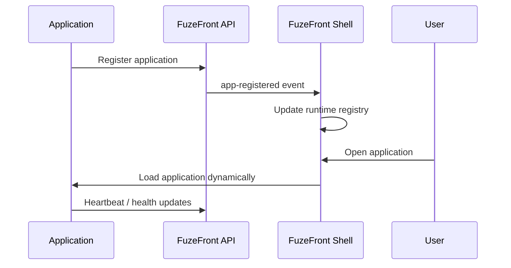

# FuzeFront

**The application layer of the Fuze Software Factory.**

Fuze is being built as an AI-native **Software Factory**: a platform that standardizes how software is planned, built, integrated, deployed, governed, observed, and operated.

FuzeFront is the unified application surface of that factory. It lets independently built applications register themselves at runtime, appear inside a common product shell, expose health and metadata, and integrate without forcing every product into one monolith.

The broader thesis is simple:

> **A very small team — potentially one founder — should be able to build and operate a portfolio of serious software products with leverage that previously required an entire company.**

That is the idea behind the **One-Man Unicorn Platform**.

## Start here

FuzeFront is being opened to developers, platform engineers, engineering leaders, founders, and teams that want to test the Software Factory model against real workloads.

| You are... | Best next step |
|---|---|
| **A developer** | Run the [Adoption Quickstart](docs/ADOPTION_QUICKSTART.md) and tell us where it breaks. |
| **A platform / DevOps engineer** | Test the Kubernetes path and challenge the runtime/infrastructure assumptions. |
| **An architect / CTO** | Join the public [Architecture Review](https://github.com/izzywdev/FuzeFront/issues/1015). |
| **A startup / engineering team** | Become a [Design Partner](https://github.com/izzywdev/FuzeFront/issues/1016) and bring a real workload. |
| **A contributor** | Read [COMMUNITY.md](COMMUNITY.md), then pick a focused issue and submit a PR. |

### We actively want criticism

Do not just star the repository. If you think a boundary is wrong, the architecture is over-engineered, an existing tool already solves a layer better, or something would fail in production, say so.

**Useful participation:**

- reproduce the quickstart and report friction;
- review the Software Factory architecture;
- test onboarding with an existing application;
- contribute examples, docs, adapters, tests, or developer-experience fixes;
- propose a real design-partner workload;
- compare Fuze to Backstage, internal developer platforms, PaaS products, agentic coding systems, or your own platform stack.

Read the full [Software Factory architecture](docs/SOFTWARE_FACTORY.md) and [Community guide](COMMUNITY.md).

---

## The Software Factory thesis

Traditional software companies scale by adding people to every stage of delivery: product, architecture, development, QA, DevOps, infrastructure, security, release, support, analytics, sales operations, and executive oversight.

The Fuze approach is to convert as much of that repeated organizational work as possible into reusable software, governed workflows, AI agents, shared infrastructure, and standardized product contracts.

The target operating model is:

```text
Idea / Goal
    │
    ▼
Planning and prioritization
    │
    ▼
Agentic SDLC governance
    │
    ▼
AI-assisted implementation
    │
    ▼
Validation / hardening / CI
    │
    ▼
Infrastructure + deployment
    │
    ▼
Runtime registration
    │
    ▼
Unified product surface
    │
    ▼
Observability / operations / business systems
```

Instead of rebuilding this pipeline for every startup or every product, Fuze aims to make the pipeline itself the platform.

## One-Man Unicorn Platform

The phrase **One-Man Unicorn Platform** describes the economic ambition behind the architecture.

AI coding alone does not create enough leverage. A founder can generate code quickly and still drown in integration, deployment, infrastructure, governance, operations, support, analytics, and coordination.

The Fuze stack addresses the layers around code generation as well.

The goal is to make it realistic for one person or a very small team to:

- create multiple software products in parallel;
- use AI agents for specialized engineering and operational roles;
- enforce one SDLC and governance model across every repository;
- reuse the same infrastructure, deployment and observability foundation;
- onboard applications into a common runtime automatically;
- operate business functions through the same platform model;
- scale the number of products faster than the number of employees.

The important metric is therefore not only developer productivity. It is **organizational leverage**.

## The Fuze stack

FuzeFront sits inside a larger architecture.

```text
┌──────────────────────────────────────────────────────────────┐
│                     Goals / Product Ideas                    │
└──────────────────────────────┬───────────────────────────────┘
                               │
                               ▼
┌──────────────────────────────────────────────────────────────┐
│                         FuzePlan                             │
│       Planning, Jira integration, insights, workflows       │
└──────────────────────────────┬───────────────────────────────┘
                               │
                               ▼
┌──────────────────────────────────────────────────────────────┐
│                         FuzeSDLC                             │
│ Canonical governance, agents, skills, CI and repo policies  │
└──────────────────────────────┬───────────────────────────────┘
                               │
                               ▼
┌──────────────────────────────────────────────────────────────┐
│                         FuzeAgent                            │
│      AI team orchestration and specialized agent roles      │
└──────────────────────────────┬───────────────────────────────┘
                               │
                               ▼
┌──────────────────────────────────────────────────────────────┐
│                         FuzeDeploy                           │
│      CI/CD, repository analysis and deployment automation   │
└──────────────────────────────┬───────────────────────────────┘
                               │
                               ▼
┌──────────────────────────────────────────────────────────────┐
│                         FuzeInfra                            │
│ Kubernetes, networking, data, messaging, observability      │
└──────────────────────────────┬───────────────────────────────┘
                               │
                               ▼
┌──────────────────────────────────────────────────────────────┐
│                         FuzeFront                            │
│ Runtime registry, application shell, auth, routing, health  │
└──────────────────────────────┬───────────────────────────────┘
                               │
          ┌────────────────────┼────────────────────┐
          ▼                    ▼                    ▼
      Product A            Product B            Product N
```

Business-facing products can then live on the same foundation, including domains such as executive oversight, sales, service, BI, finance, contact management, social, commerce, and other product-specific applications.

The result is not one application. It is a **repeatable product-production system**.

## Why FuzeFront matters

A Software Factory needs a common runtime destination for what it produces.

FuzeFront provides that layer.

Applications can:

- register themselves dynamically at runtime;
- appear without rebuilding the central shell;
- integrate using Module Federation, iframes, or Web Components;
- publish and maintain health status;
- participate in common navigation and authentication;
- run on shared Kubernetes infrastructure;
- evolve independently while still looking like one platform to the user.

This separation is important: the factory can produce many applications without turning the platform itself into a tightly coupled monolith.

## Current platform capabilities

### Runtime application platform

- Runtime Module Federation
- Dynamic application discovery
- Self-registration through REST APIs
- Multiple integration models
- WebSocket-based real-time status
- Health monitoring
- Shared navigation
- Deep linking
- Authentication and RBAC
- English / Hebrew internationalization
- Responsive application shell

### Production-oriented runtime

- Docker images
- Kubernetes deployment
- Helm charts
- kind for local Kubernetes
- k3s for production
- Argo CD / GitOps
- ingress-nginx
- TLS / cert-manager integration

### Shared infrastructure through FuzeInfra

The platform is designed to consume shared infrastructure rather than recreate it per product, including services such as:

- PostgreSQL
- MongoDB
- Redis
- Neo4j
- ChromaDB
- Kafka
- RabbitMQ
- Consul
- Prometheus
- Grafana
- Loki
- DNS and local TLS tooling
- Cloudflare Tunnel integration

## Agentic SDLC

The broader Fuze platform uses **FuzeSDLC** as the canonical governance layer across repositories.

It defines:

- organization-level baseline policy;
- specialized agent roles;
- reusable agent skills;
- repository overlays;
- hardening and release gates;
- CI workflow templates;
- repository onboarding rules;
- routing and ownership rules;
- drift detection between canonical and runtime configuration.

That matters because a Software Factory cannot depend on every AI session improvising its own development process. The development system itself needs to be versioned, governed, repeatable, and auditable.

## AI team orchestration

FuzeAgent explores the next layer: specialized AI workers coordinated as an organization rather than one general-purpose chat session.

The architecture includes orchestration, agent management, message queues, persistent state, management APIs, and role-oriented agents.

The strategic idea is that the factory should eventually be capable of delegating work across engineering and business functions while preserving common governance.

## From repository to production

The intended end-to-end flow is increasingly platformized:

1. A product requirement or business goal is created.
2. Work is planned and decomposed.
3. FuzeSDLC determines the canonical workflow, policies, agents, and gates.
4. AI-assisted implementation happens inside a governed repository.
5. CI validates and hardens the result.
6. Deployment automation produces or applies runtime infrastructure.
7. FuzeInfra provides shared production services.
8. The application registers into FuzeFront.
9. Users access it through the common platform surface.
10. Operational and business applications can consume the same platform capabilities.

Each additional product should therefore benefit from infrastructure and operational work already completed for previous products.

That compounding reuse is the core platform advantage.

## Investment thesis

The venture-scale opportunity, if the model is proven, is not primarily a better microfrontend framework.

It is the possibility of turning software-company formation itself into a repeatable technical system.

The thesis depends on demonstrating three things:

1. **Production capability** — the platform can produce and operate real applications, not only demos.
2. **Repeatability** — subsequent products become materially easier to create because they inherit the factory.
3. **Non-linear leverage** — product output grows substantially faster than engineering and operational headcount.

If those properties hold, the addressable value moves beyond developer tooling toward the much larger cost base of building and operating software businesses.

## FuzeFront architecture

FuzeFront is an npm-workspaces monorepo containing:

- `backend/` — Node.js / Express API server
- `frontend/` — React / Vite platform shell
- `shared/` — shared types and utilities
- `sdk/` — integration SDK
- `api-client/` — generated API client
- `clock-app/` — example federated application
- `envmanager/` — environment configuration tooling
- `FuzeInfra/` — infrastructure integration
- `deploy/helm/fuzefront/` — Kubernetes Helm chart
- `deploy/contabo/` and `deploy/argocd/` — production GitOps assets

## Dynamic discovery flow


```mermaid
sequenceDiagram
    participant A as Application
    participant B as FuzeFront API
    participant H as FuzeFront Shell
    participant U as User

    A->>B: Register application
    B->>H: app-registered event
    H->>H: Update runtime registry
    U->>H: Open application
    H->>A: Load application dynamically
    A->>B: Heartbeat / health updates
```

## Quick demo

### Development mode

```bash
npm run install:all
npm run db:init
npm run db:seed
npm run demo
```

This starts the platform shell, backend API, and an example application.

### Local Kubernetes

```bash
cd FuzeInfra && make kind-up && cd ..

docker build -t fuzefront/backend:local ./backend
docker build -t fuzefront/frontend:local \
  --build-arg VITE_API_URL=http://fuzefront.dev.local ./frontend

kind load docker-image \
  fuzefront/backend:local \
  fuzefront/frontend:local \
  --name fuzeinfra

helm upgrade --install fuzefront deploy/helm/fuzefront \
  -n fuzefront --create-namespace \
  -f deploy/helm/fuzefront/values-local.yaml
```

Add `127.0.0.1 fuzefront.dev.local` to your hosts file and open `http://fuzefront.dev.local`.

## Tech stack

- **Frontend:** React, TypeScript, Vite, Module Federation
- **Backend:** Node.js, Express, TypeScript, Socket.IO
- **Integration:** Module Federation, iframe, Web Components
- **Data:** SQLite locally, PostgreSQL in shared infrastructure
- **Containers:** Docker
- **Orchestration:** Kubernetes, Helm, kind, k3s
- **GitOps:** Argo CD
- **Ingress:** ingress-nginx

## Creating a new application

A new application can integrate with FuzeFront using the SDK and runtime registration model.

```bash
npm create vite@latest my-app -- --template react-ts
npm install @originjs/vite-plugin-federation --save-dev
```

Applications then configure their integration contract, register with FuzeFront, and send health information to the platform.

The longer-term direction is to make this onboarding increasingly automatic through the Fuze Software Factory.

## Production

Production deployments use Kubernetes and GitOps. Current deployment assets target a Contabo k3s cluster managed through Argo CD, with GHCR images and cert-manager for TLS.

See:

- `docs/PRODUCTION_DEPLOYMENT.md`
- `deploy/contabo/README.md`
- `deploy/helm/fuzefront/README.md`

## Security

Current platform capabilities include:

- JWT-based authentication
- RBAC
- CORS controls
- Helmet security headers
- input validation and sanitization
- SDLC hardening and security workflows through the broader Fuze governance model

## Roadmap direction

The roadmap is centered on increasing factory automation and decreasing per-product manual work.

Current and planned areas include:

- richer plugin and integration models;
- automated onboarding of new products;
- stronger CI/CD generation and remediation;
- deeper observability and analytics;
- multi-tenant platform capabilities;
- automated product templates;
- broader agent orchestration;
- business-function agents and applications;
- end-to-end goal-to-production automation.

## Contributing

See:

- `COMMUNITY.md`
- `CONTRIBUTING.md`
- `CODE_OF_CONDUCT.md`
- `SECURITY.md`

## License

This repository is licensed under the MIT License. See `LICENSE` for details.

---

**FuzeFront is not intended to be the whole factory. It is where the output of the factory becomes a coherent product platform.**
