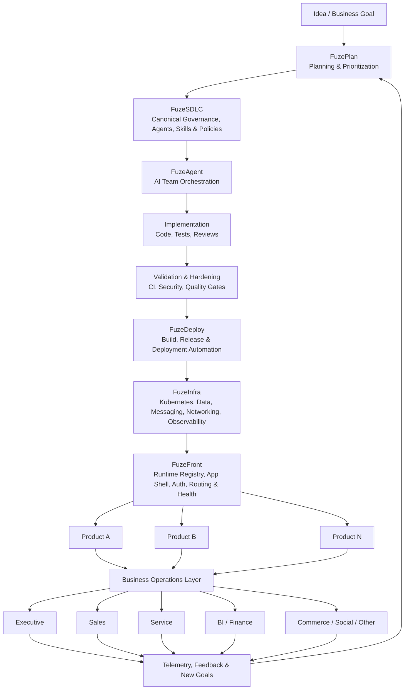
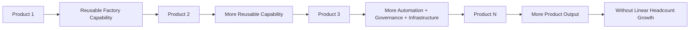

# Fuze Software Factory

Fuze is an AI-native **Software Factory**: a platform designed to make the full software-production system reusable across products — not only code generation, but planning, governance, agent orchestration, CI/CD, infrastructure, deployment, runtime integration, observability, and business operations.

## Factory map

## The compounding loop

The core advantage is not that one application is easier to build. It is that **every additional product should inherit more of the factory built for the products before it**.

## One-Man Unicorn thesis

The **One-Man Unicorn Platform** is the economic thesis behind the architecture:

> A founder or very small team should be able to build and operate a portfolio of serious software products with organizational leverage that previously required a much larger company.

This is not a claim that AI can replace an entire company today. It is a measurable hypothesis: **can product output grow materially faster than engineering and operational headcount because each product inherits planning, governance, agents, infrastructure, deployment, runtime, and operational capabilities from a shared factory?**

If that compounding effect can be demonstrated in production, the platform becomes more than developer tooling. It becomes infrastructure for creating and operating software businesses.

## Public entry points

- [FuzeFront](https://github.com/izzywdev/FuzeFront) — application/runtime layer
- [FuzeInfra](https://github.com/izzywdev/FuzeInfra) — shared infrastructure platform
- [FuzeAgent](https://github.com/izzywdev/FuzeAgent) — AI team orchestration

Some additional factory components are currently private or experimental and are described publicly only at the architectural level.
