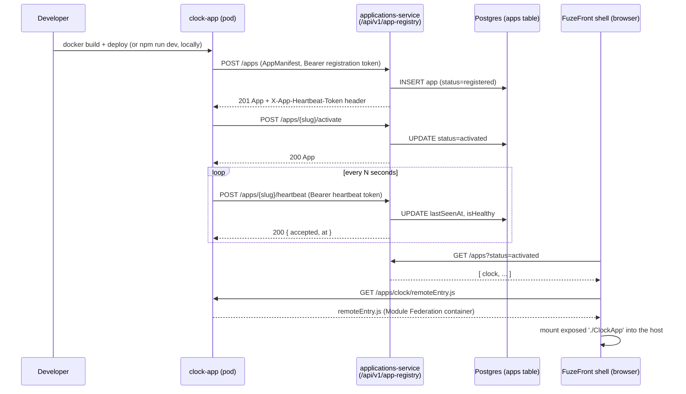

# Reference app onboarding: from zero to registered runtime

A concrete, copy-pasteable walkthrough of turning a tiny standalone React/Vite
app into a FuzeFront application — registered, activated, mounted in the host
shell, and reporting liveness. This closes the gap between the conceptual docs
([`BUILDING_ON_FUZEFRONT.md`](BUILDING_ON_FUZEFRONT.md),
[`mfe-self-registration.md`](../mfe-self-registration.md)) and an actual,
reproduced run: every command below was run against this repo's own local e2e
stack, and the failure modes in [Troubleshooting](#troubleshooting) are real
ones hit while writing this guide, not hypothetical ones.

The worked example is **`clock-app`** (`clock-app/` at the repo root) — it is
already a tiny standalone Vite + React app (one `App.tsx`, one `main.tsx`, no
router, no state library) and it is the smallest real app in this repo, so it
doubles as the "tiny app" the walkthrough starts from. One divergence is
flagged up front so it doesn't quietly mislead you: in **this repo**, `clock`
is seeded as a `builtin: true` app (see "Friction encountered" below) rather
than self-registering through the kit. The steps below register it the way an
**external** product does — the path your own app will actually use.

---

## What "registered in the runtime" means

Two independent things have to be true before a user ever sees your app:

1. **Module Federation remote** — your app builds a `remoteEntry.js` that
   exposes a module the shell can load at runtime, with React/React-DOM as
   shared singletons.
2. **App registry entry** — a manifest describing that remote (plus menu
   placement, routing, and visibility) is registered and *activated* against
   `/api/v1/app-registry`. An app can build a perfect remote and still never
   appear, because it was never registered; equally, a registered-but-wrong
   manifest surfaces as a blank panel even though the healthcheck is green.

Both are required. Neither implies the other.



---

## Prerequisites

- Node `>=24.0.0`, npm `>=10.0.0` (see the toolchain table in the root
  `CLAUDE.md`).
- Docker Desktop running, for the local stack.
- This repo cloned, with the local e2e stack reachable — follow
  [`docs/ADOPTION_QUICKSTART.md`](../ADOPTION_QUICKSTART.md) §1 first if you
  have not already; this guide assumes the stack from
  `docker-compose.e2e.yml` is up (`backend` on `:3001`, `frontend` preview on
  `:4173`) and you have a signed-in session.

---

## Step 1 — Start from the tiny standalone app

`clock-app` as it sits in this repo, stripped of the parts that make it a
Module Federation remote, is nothing more than:

```
clock-app/
  index.html
  src/main.tsx      # ReactDOM.createRoot(...).render(<App />)
  src/App.tsx        # a clock, a greeting toast, nothing else
  vite.config.ts      # plain `defineConfig({ plugins: [react()] })`
  package.json
```

That is "a tiny standalone React/Vite app" in the literal sense the issue
asks for — it has zero FuzeFront awareness. Everything from here on is what
you add to make it one.

If you are starting a **new** app rather than following along with
`clock-app`, scaffold it the ordinary way and come back here:

```bash
npm create vite@latest my-app -- --template react-ts
cd my-app && npm install
```

## Step 2 — Expose it as a Module Federation remote

Add `@originjs/vite-plugin-federation` and expose one module. This is
`clock-app/vite.config.ts` as it actually exists in this repo today:

```ts
// vite.config.ts
import { defineConfig } from 'vite'
import react from '@vitejs/plugin-react'
import federation from '@originjs/vite-plugin-federation'

export default defineConfig({
  plugins: [
    react(),
    federation({
      name: 'clockApp', // becomes the registry `scope`
      filename: 'remoteEntry.js',
      exposes: { './ClockApp': './src/App' }, // becomes the registry `module`
      shared: {
        // MUST be explicit singletons on the SAME major as the host. The bare
        // `['react', 'react-dom']` shorthand does not set `singleton` and lets
        // the remote load its own React copy — it then dies with "Invalid
        // hook call" at runtime, with nothing in CI to catch it beforehand.
        react: { singleton: true, requiredVersion: '^19.0.0' },
        'react-dom': { singleton: true, requiredVersion: '^19.0.0' },
      },
    }),
  ],
  // Served at /apps/clock/ — remoteEntry.js ends up at /apps/clock/remoteEntry.js.
  // This MUST agree with the `remoteEntry` URL in the manifest (Step 3) and with
  // wherever your ingress/nginx actually serves the build. See Troubleshooting #1.
  base: '/apps/clock/',
  build: {
    target: 'esnext',
    assetsDir: '', // keeps remoteEntry.js at the base path, not under assets/
  },
})
```

```bash
cd clock-app
npm install
npm run build        # emits dist/remoteEntry.js + dist/App-*.js
npx vite preview --port 4174 --host 0.0.0.0
```

Confirm the remote is actually servable before touching the registry — this
separates a Module Federation problem from a registration problem:

```bash
curl -sS http://localhost:4174/remoteEntry.js | head -c 200
# expect JS (a `var clockApp = ...` container), not an HTML error page
```

## Step 3 — The registration contract and required metadata

The contract is `services/app-registry-service/openapi.yaml`; the document
your app submits is an **`AppManifest`**. Minimum viable manifest for a
Module-Federation app:

```json
{
  "manifestVersion": "1",
  "slug": "clock",
  "name": "Clock",
  "menuLabel": "Clock",
  "description": "An on-the-fly example federated app.",
  "mode": "portal",
  "integration": {
    "type": "module-federation",
    "remoteEntry": "http://localhost:4174/remoteEntry.js",
    "scope": "clockApp",
    "module": "./ClockApp"
  },
  "nav": { "section": "platform", "order": 50 },
  "routing": { "path": "/app/clock" },
  "visibility": "organization"
}
```

| Field | Meaning | Required |
|---|---|---|
| `slug` | Immutable, free-form identifier (`clock`). Never edited once registered — a redeploy under a changed slug registers a *second* app. | yes |
| `name` / `menuLabel` | Display strings. Mutable, and — by family convention, not a schema rule — drop any `Fuze` prefix unless the remainder is meaningless alone (only `FuzeBI`/`FuzeX` keep it). | yes |
| `mode` | `portal` (lives in the shell) or `standalone` (needs `routing.host`, for a mobile TWA to wrap). | yes |
| `integration.type` / `remoteEntry` / `scope` / `module` | How the shell mounts the remote. `scope`/`module` must match the federation `name`/`exposes` key from Step 2 exactly. | yes |
| `nav.section` / `nav.order` | Side-menu placement. Omit and the app lands in `platform` at order `999` — i.e. last. | no (but you probably want it) |
| `routing.path` | In-shell route. Independent of `slug` — a different value is normal, not a bug. | no |
| `visibility` | Who can see/activate it. | yes |
| `policy.json` / `billing-profile.json` | Optional sibling files — a product's own Permit roles / billing product key, submitted alongside the manifest. Omit if the app has no roles of its own or never takes payment. | no |

Register, then activate — a registered app is **not** visible until
activated:

```bash
TOKEN="<your signed-in session JWT, or the platform registration token for a service call>"

curl -sS -X POST http://localhost:3001/api/v1/app-registry/apps \
  -H "Authorization: Bearer ${TOKEN}" \
  -H 'Content-Type: application/json' \
  -d @manifest.json | tee /tmp/register-response.json

# capture the heartbeat token for Step 5 — it's returned OUT OF BAND in a
# response header, never in the JSON body
grep -i 'x-app-heartbeat-token' -m1 <(curl -sSi -X POST \
  http://localhost:3001/api/v1/app-registry/apps \
  -H "Authorization: Bearer ${TOKEN}" -H 'Content-Type: application/json' \
  -d @manifest.json 2>&1) || true

curl -sS -X POST http://localhost:3001/api/v1/app-registry/apps/clock/activate \
  -H "Authorization: Bearer ${TOKEN}"
```

Expected: `201` on register (`"status": "registered"`), `200` on activate
(`"status": "activated"`). A `409` on register means the slug already exists
— see Troubleshooting #3.

> **Production / Kubernetes path.** The above is the raw HTTP contract, useful
> for understanding it and for local iteration. For an actual deploy, use
> [`@fuzefront/onboarding-kit`](../../packages/onboarding-kit/README.md): copy
> its `registration/` templates, paste its init-container snippet into your
> Deployment, and it does the register → activate → policy → billing sequence
> idempotently on every pod start, hard-failing the pod (CrashLoopBackOff) if
> it cannot — on purpose, because an unregistered app cannot authenticate
> users or be authorized at all.

## Step 4 — Auth and routing assumptions

- **Same-origin API, always.** The shell and every registered app call
  `/api/v1/...` relative to the current origin — never an absolute,
  cross-origin API host. This is why `remoteEntry` should be a same-origin
  path (`/apps/clock/remoteEntry.js`) rather than its own public hostname
  whenever the app runs in the same cluster: a separate hostname means CORS,
  and if that hostname sits behind the admin Cloudflare Access wall, the
  federation runtime fails with a *build-sounding* error
  ("Failed to fetch dynamically imported module") that is actually an HTML
  login page being served in place of JS.
- **Two distinct bearer-token shapes, two distinct trust models.** A JWT
  (`header.payload.signature`, two dots) is an Authentik-issued user session,
  validated per request and authorized via Permit. A flat hex string with no
  dots is the shared platform `CONSUMER_REGISTRATION_SECRET` — it grants
  platform-admin on the registry *only* for the registration routes, bypasses
  Permit entirely, and is never a user credential. Sending the wrong shape to
  the wrong place produces a *correctly fail-closed but confusing* error — see
  Troubleshooting #2.
- **The registry is the only truth for menu visibility.** The host calls
  `GET /apps?status=activated`, sorts by `(nav.section, nav.order)`, and
  renders exactly that. There is no secondary config anywhere else that also
  controls what appears.
- **Serve path is a free variable, consistent across four layers** — the
  manifest's `integration.remoteEntry`, the Vite/webpack `base`, the ingress
  `path`, and the nginx `location`/`alias` all have to agree on the same
  prefix. None of them is derived from `slug`; mismatching any one of them is
  Troubleshooting #1.

## Step 5 — Health and heartbeat

Registration alone does not prove the app is *alive* right now — that is what
the heartbeat is for.

- `registerApp` returns a **per-app heartbeat token**, out-of-band, in the
  `X-App-Heartbeat-Token` response header (never in the JSON body — grep for
  it case-insensitively, as in Step 3).
- The running app calls `POST /apps/{slug}/heartbeat` with that token as its
  bearer (a different credential from both the JWT and the shared
  registration secret — it authenticates *this one app process*, nothing
  else):

  ```bash
  HEARTBEAT_TOKEN="<captured from the register response header>"

  curl -sS -X POST http://localhost:3001/api/v1/app-registry/apps/clock/heartbeat \
    -H "Authorization: Bearer ${HEARTBEAT_TOKEN}" \
    -H 'Content-Type: application/json' \
    -d '{"status": "online"}'
  # => { "accepted": true, "at": "2026-10-05T..." }
  ```

- Each accepted heartbeat updates `lastSeenAt` and `isHealthy` on the app
  record (`GET /apps/clock` surfaces both). A dashboard or your own uptime
  check reads those two fields rather than inferring liveness from the
  federation load succeeding once at mount time.
- This mirrors — and is the versioned successor to — the legacy
  `POST /api/apps/:id/heartbeat` route (`backend/src/routes/apps.ts`), which
  still exists for apps on the older numeric-id registration path and emits a
  live `app-status-changed` Socket.io event the shell listens for. New apps
  should target the manifest-based `/apps/{slug}/heartbeat` route above; both
  ultimately answer "is this app alive right now?"

There is no required heartbeat *interval* enforced by the contract — pick one
that fits your deploy (every 30–60s is typical) and treat a stale
`lastSeenAt` as degraded rather than a hard failure, since a heartbeat miss
during a rolling deploy is normal.

## Step 6 — Verify end to end

1. Refresh the shell at `http://localhost:4173`.
2. Open the sidebar — **Clock** (or your app's `menuLabel`) should appear
   under the section you declared in `nav.section`.
3. Click it. Expected: the app mounts inside the shell, and if it reads
   platform context it shows something like "Mounted inside FuzeFront: yes"
   plus your signed-in email.
4. `GET /apps/clock` should show `"status": "activated"`, a non-null
   `lastSeenAt`, and `"isHealthy": true` once at least one heartbeat has
   landed.

If step 2 or 3 fails, go to Troubleshooting below before assuming the remote
itself is broken — most failures at this stage are a mismatch between two of
the four layers in Step 4, not a React bug.

---

## Troubleshooting

### 1. The app is in the menu, clicking it shows a blank panel, and the healthcheck is green

**Symptom:** `remoteEntry.js` returns `200`, but the browser console shows
404s for the chunks it imports (or a generic "Failed to fetch dynamically
imported module").

**Cause:** the four layers in Step 4 disagree on the serve path — most
commonly, `vite.config.ts`'s `base` was left as the Vite default (`/`) while
the manifest's `remoteEntry` and the ingress both assume `/apps/clock/`. The
remote itself loads (hence "healthy"), but every asset path it emits is
relative to the wrong base and 404s against the shell's own origin.

**Fix:** set `base` in `vite.config.ts` to the exact prefix the manifest and
ingress use, rebuild, and confirm with `curl` that a chunk path referenced
*inside* `remoteEntry.js` (not just the file itself) resolves:

```bash
curl -sS http://localhost:4174/remoteEntry.js | grep -o "'\./[A-Za-z0-9_.-]*\.js'" | head -5
# then curl each one at the SAME prefix remoteEntry.js was served from
```

### 2. Registration calls fail with a confusing 401, even though the token "looks right"

**Symptom:** `POST /apps` (or the heartbeat/activate routes) returns `401`,
and the token being sent is definitely non-empty.

**Cause (two variants, tell them apart by the error body, per Step 4):**
- `{"error": "invalid_registration_token"}` — you sent the shared
  `CONSUMER_REGISTRATION_SECRET`-shaped value (flat hex, no dots), but it does
  not match what this backend has configured. This is a legacy-path
  (`/api/apps/register`) error shape; it means the secret is wrong, not
  missing.
- A plain `401 Unauthorized` from `/api/v1/app-registry/*` — you sent a user
  JWT without `apps:register` scope (most session JWTs for a non-admin
  member), or sent the heartbeat token to the register/activate endpoints
  instead of a session token (the heartbeat token is scoped to exactly one
  route).

**Fix:** confirm which of the three credential types (user JWT, platform
registration secret, per-app heartbeat token) the specific route expects —
Step 3 uses a session/service JWT for register+activate; Step 5 uses the
heartbeat token, and only for the heartbeat route. Swapping any two of them
produces this error.

### 3. `POST /apps` returns `409` on a redeploy

**Symptom:** a routine redeploy of an already-registered app fails
registration with `409 An app with this slug already exists`, and the init
container (if using the onboarding kit) CrashLoopBackOffs.

**Cause:** the raw `POST /apps` call always attempts a fresh registration.
It is correct that a second registration of an existing slug is rejected —
`slug` is immutable and a silent second row would strand the first app's
grants/installs (see the root `CLAUDE.md` § "`slug` — free at creation,
immutable thereafter"). The failure here is calling the wrong operation, not
a platform bug.

**Fix:** check-then-write, exactly as `@fuzefront/onboarding-kit`'s
`register.sh` does — `GET /apps/{slug}` first:
- `404` → `POST /apps` (register), then `POST .../activate`.
- `200` + `status: registered` → `POST .../activate` only.
- `200` + already `activated` → `PUT /apps/{slug}` to refresh the manifest
  (so manifest edits on redeploy aren't silent no-ops), and do nothing else.

Hand-rolling this sequence yourself (rather than using the kit) is exactly
what produced this failure mode while writing this guide — see "Friction
encountered" below.

---

## Friction encountered

In the spirit of capturing friction rather than hiding it:

- **Two registration systems coexist**, and nothing in the UI or error
  messages tells you which one you're talking to. The legacy
  `POST /api/apps/register` + numeric `:id` heartbeat
  (`backend/src/routes/apps.ts`) and the current manifest-based
  `/api/v1/app-registry` (slug-based, this guide's Step 3–5) answer similarly
  shaped requests at similarly shaped URLs. `BUILDING_ON_FUZEFRONT.md`
  documents the legacy path under "Register a Module-Federation app" and only
  flags it as superseded in a callout further down the page — easy to follow
  the first path you find and build against the one that is explicitly not
  the current one.
- **`clock-app`, the obvious reference to copy, is not onboarded the way an
  external app has to be.** It is seeded directly into `BUILTIN_MANIFESTS`
  (`builtin: true`) rather than self-registering via the init container and
  `@fuzefront/onboarding-kit`, and the local e2e stack registers it with a
  single raw SQL `INSERT` (see `docs/ADOPTION_QUICKSTART.md` §1, step 3)
  rather than calling the registration API at all. Copying clock-app's own
  deploy mechanics would not actually demonstrate the registration contract
  — which is why this guide registers it over HTTP from scratch instead of
  pointing at how it's really wired in this repo.
- **The heartbeat token is easy to lose.** It is returned once, in a response
  header, on the single `POST /apps` call that creates the app — never in the
  JSON body, and never retrievable again afterward. A naive `curl | jq` that
  only looks at the body (as most of this repo's other examples do) silently
  drops it, and there is no "reissue my heartbeat token" endpoint if you do.
- **`manifestVersion`, `mode`/`modes`, and `nav` are all individually
  optional**, so a manifest that omits `nav` registers and activates
  cleanly, with no warning anywhere in the HTTP response — it simply sorts
  last in the menu. The `onboarding-kit`'s `register.sh` prints a log warning
  for this; the raw API calls in this guide do not, which makes a silently
  wrong menu position easy to ship if you skip the kit.

---

## See also

- [`docs/ADOPTION_QUICKSTART.md`](../ADOPTION_QUICKSTART.md) — stand up the
  local stack this guide assumes.
- [`docs/guides/BUILDING_ON_FUZEFRONT.md`](BUILDING_ON_FUZEFRONT.md) — the
  conceptual reference for Module Federation + the shared-package contract.
- [`docs/mfe-self-registration.md`](../mfe-self-registration.md) and
  [`packages/onboarding-kit/README.md`](../../packages/onboarding-kit/README.md)
  — the production, idempotent, init-container version of Steps 3–5.
- [`services/app-registry-service/openapi.yaml`](../../services/app-registry-service/openapi.yaml)
  — the frozen contract itself; the single source of truth if this guide and
  the API ever disagree.
